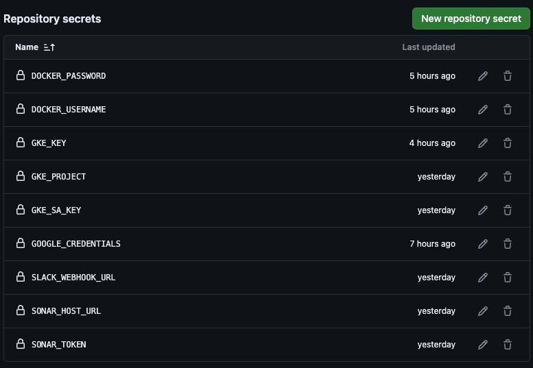
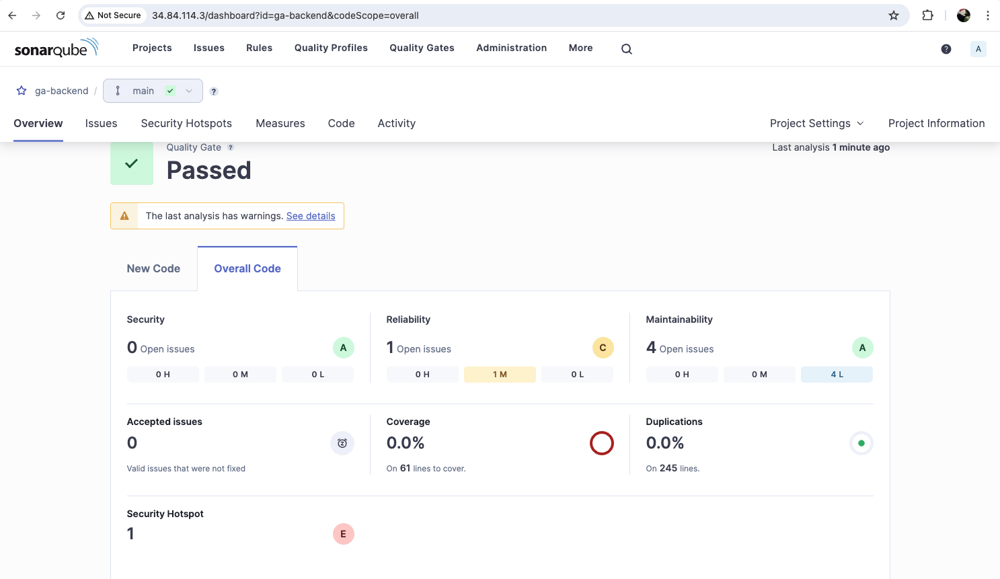
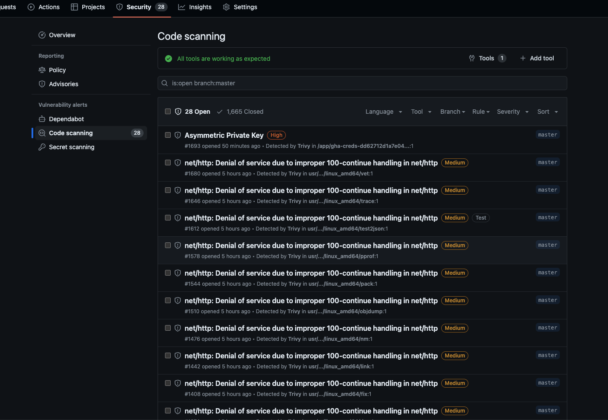
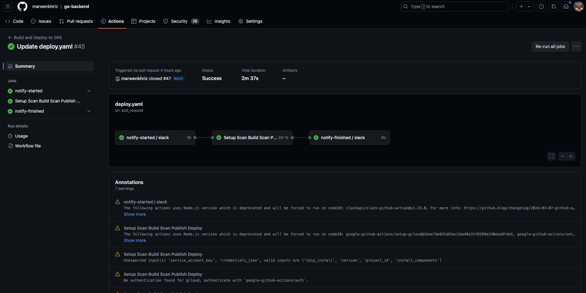
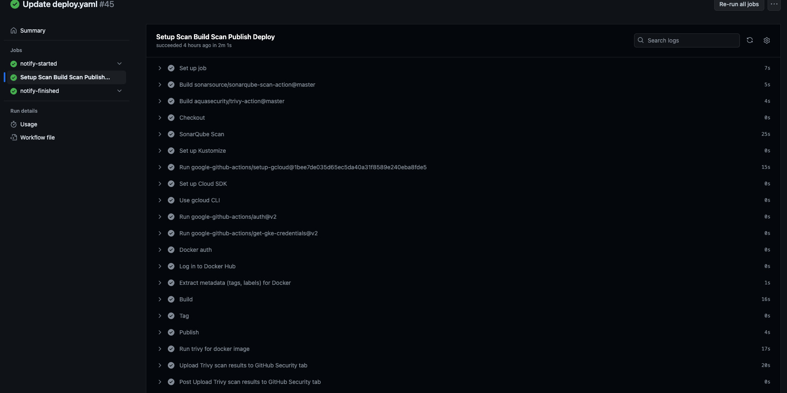

# Building Golang Users API and Deploying to Google Kubernetes Engine Using Github Actions

## Getting Started
If this is your first time encountering Go, please follow the [instructions](https://go.dev/doc/install) to install Go on your computer. The kit requires Go 1.24 or above.

[Docker](https://www.docker.com/get-started/) is also needed if you want to try the kit without setting up your own database server. The kit requires Docker 17.05 or higher for the multi-stage build support.

After installing Go and Docker, run the following commands to start experiencing this starter kit:

```sh
// init 
go mod init github.com/marwenbhriz/ga-backend

// install modules
got mod tidy

// run
go run main.go OR make run OR ./do.sh start
```

> Note: Ensure to run mysql database first before start the api server.

```sh
// run mysql db 
docker run --name userdb -e MYSQL_ROOT_PASSWORD=root -d -p 3307:3306 mysql:latest

docker exec -it userdb bash 

mysql -u root -proot 

CREATE DATABASE users;
```

## Prerequisites

### Creating a GKE cluster
To create the GKE cluster, we need to use [ga-terraform](https://github.com/marwenbhriz/ga-terraform), its using terraofmr and github actions to deploy our infra.

### Setup sonarqube server.
To install sonarqube server, we need to use [ga-tools](https://github.com/marwenbhriz/ga-tools).

### Configure pipeline secrets
For our workflow we need to use a secrets to inject into our pipeline, like slack webhook, gcp creds, sonaqube token ...



### Creating the workflow {Marwen / Dev Team}
1. Create new pr using the existent pr template stored .github repo, its automaticlly genrated when open pr, submit pr and ask for review.
2. Once PR approved and merged, github action on pr closed {master branch} automaticlly start the workflow.
3. 1. First stage: sonarqube for checking code, you can check the report for here: http://34.84.114.3/dashboard, should be passed to move to next step.

3. 2. start preparing gcloud cli and auth to gcloud using the service account key method and upload to secret, and get creds for gke cluster.
3. 3. setup and install kustomize
3. 4. docker auth and start building an image and tag with artifact registry and push.
3. 4. Run trivy for docker image and Upload Trivy scan results to GitHub Security tab to scan and check our image.

3. 5. Start deployment of our backend, follwing k8s deployment startegy rolling update to ensure the HA of our product.
```sh
Run ./kustomize edit set ***/ga-backend:latest
Sets the value of different fields in kustomization file.

Usage:
  kustomize edit set [command]

Examples:

	# Sets the nameprefix field
	kustomize edit set nameprefix <prefix-value>

	# Sets the namesuffix field
	kustomize edit set namesuffix <suffix-value>


Available Commands:
  image       Sets images and their new names, new tags or digests in the kustomization file
  nameprefix  Sets the value of the namePrefix field in the kustomization file.
  namespace   Sets the value of the namespace field in the kustomization file
  namesuffix  Sets the value of the nameSuffix field in the kustomization file.

Flags:
  -h, --help   help for set

omize edit set [command] --help" for more information about a command.
service/ga-backend-service created
deployment.apps/ga-backend created
horizontalpodautoscaler.autoscaling/ga-backend-hpa unchanged
Waiting for deployment "ga-backend" rollout to finish: 0 of 1 updated replicas are available...
```



3. 6. Slack notification in deployment channel.


### Kubernetes 
#### 𝗥𝗼𝗹𝗹𝗶𝗻𝗴 𝗨𝗽𝗱𝗮𝘁𝗲 Deployment Strategy
Application instances are updated one by one, ensuring high availability during the process.
Downtime: No. Use Case:Periodic releases.

Check docker/k8s/deployments.yaml Line: 10.

#### Kubernetes HPA Strategies
Set HPA for autoscaling of pods in case of cpu usage => 80%.

```sh
metadata:
  name: ga-backend-hpa
spec:
  scaleTargetRef:
    apiVersion: apps/v1
    kind: Deployment
    name: ga-backend
  minReplicas: 1
  maxReplicas: 3
  metrics:
    - type: Resource
      resource:
        name: cpu
        target:
          type: Utilization
          averageUtilization: 80
```


